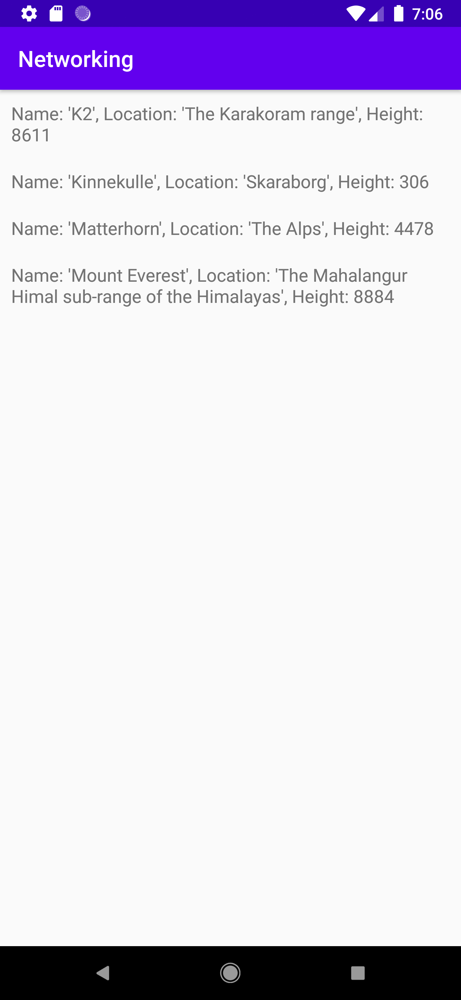

# Rapport

**Skriv din rapport här!**

Först lades en RecyclerView widget till i "activity_main.xml".

Koden ser ut som följande:

Lade in en RecyclerView widget i activity:main.xml med hjälp av följande kod:

```
    <androidx.recyclerview.widget.RecyclerView
        android:id="@+id/recycler_view"
        android:layout_width="match_parent"
        android:layout_height="match_parent"
        app:layout_constraintBottom_toBottomOf="parent"
        app:layout_constraintLeft_toLeftOf="parent"
        app:layout_constraintRight_toRightOf="parent"
        app:layout_constraintTop_toTopOf="parent" />
```

För att kunna använda RecyclerView implementerades följande kod i build.gradle:

```
implementation 'androidx.recyclerview:recyclerview:1.2.1'

```

En klass lades in, Mountain, som representerar berg och kan ha ett namn, plats och höjd. Detta
gjordes med hjälp av följande kod:

```
public class Mountain {
    private String name;
    private String location;
    @SerializedName("size")
    private int height;

    public Mountain(String name, String location, int height) {
        this.name = name;
        this.location = location;
        this.height = height;
    }
    @Override
    public String toString() {
        return "Name: '" + name + '\'' +
                ", Location: '" + location + '\'' +
                ", Height: " + height;
    }
}

```

En ny ny fil skapades, mountain_item.xml. Här används en LinearLayout och en TextView för hur 
berg ska visas inuti RecyclerView. Detta implementerades genom följande kod:

```
<?xml version="1.0" encoding="utf-8"?>
<LinearLayout xmlns:android="http://schemas.android.com/apk/res/android"
    android:layout_width="match_parent"
    android:layout_height="wrap_content"
    android:orientation="horizontal"
    android:padding="10dp">

    <TextView
        android:id="@+id/mountain"
        android:layout_width="wrap_content"
        android:layout_height="wrap_content"
        android:textSize="16sp" />

</LinearLayout>
```

En adapter skapades som bestämmer vad som ska visas inuti RecyclerView. Här läggs även en 
klick funktion in till bergen. Denna adapter använder en metod, toString, i klassen Mountain, som
hämtar info om berg i form av en sträng. 


I MainActivity.java skapades en onCreate metod där RecyclerView skapas. Implementationen av detta
ser ut på följande sätt:

```
private RecyclerViewAdapter adapter;
    private ArrayList<Mountain> items;

    @Override
    protected void onCreate(Bundle savedInstanceState) {
        super.onCreate(savedInstanceState);
        setContentView(R.layout.activity_main);

        new JsonFile(this, this).execute(JSON_FILE);

        adapter = new RecyclerViewAdapter(this, items, new RecyclerViewAdapter.OnClickListener() {
            @Override
            public void onClick(Mountain item) {
                Toast.makeText(MainActivity.this, item.toString(), Toast.LENGTH_SHORT).show();
            }
        });

        RecyclerView view = findViewById(R.id.recycler_view);
        view.setLayoutManager(new LinearLayoutManager(this));
        view.setAdapter(adapter);
    }
```

Berg hämtas från "FamousPeaksJSON URL". Detta i form av en sträng. JSON strängen hämtas med hjälp 
av en kodsnutt i onCreate metoden samt en variabel som har korrekt URL, som kan ses nedan:

```
private final String JSON_URL = "https://mobprog.webug.se/json-api?login=brom";

new JsonTask(this).execute(JSON_URL);
```

Detta sparas i en ArrayList som heter items inuti onPostExecute funktionen. Där adaptern uppdateras
samt informationen i RecyclerView. 

```
    @Override
    public void onPostExecute(String json) {
        Type type = new TypeToken<List<Mountain>>() {
        }.getType();
        items = gson.fromJson(json, type);

        adapter.setItems(items);
        adapter.notifyDataSetChanged();
    }
```


